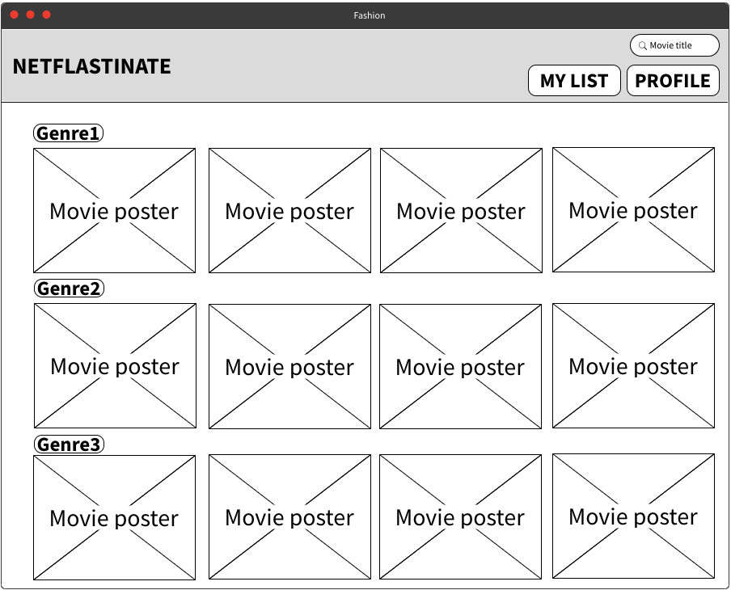
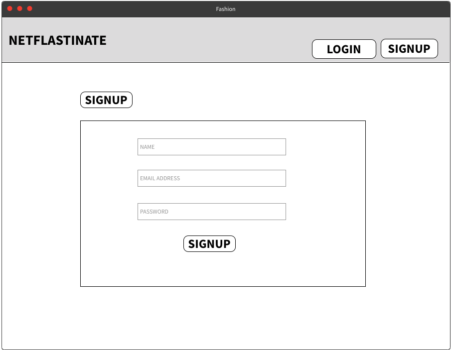
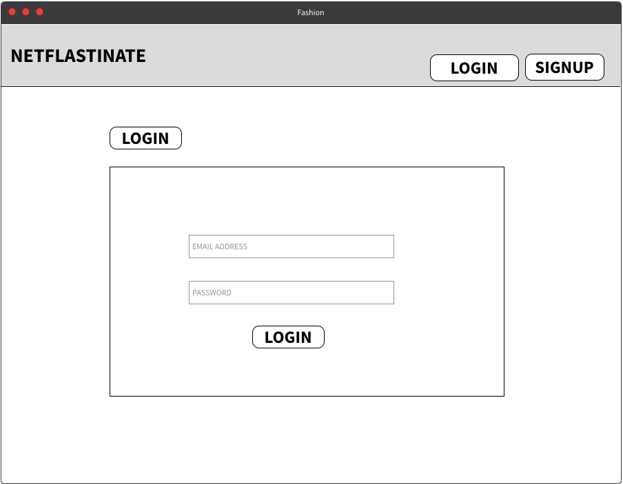
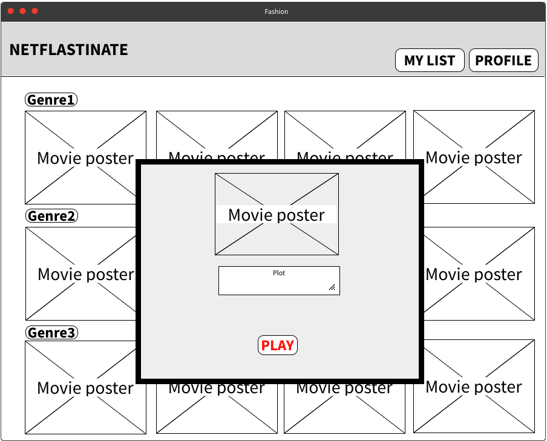
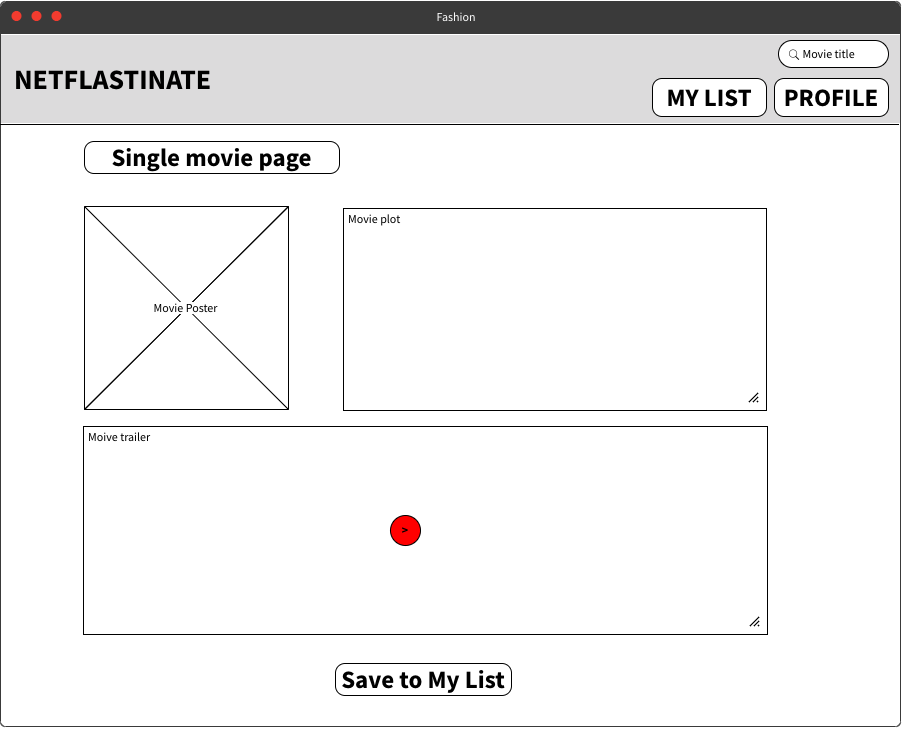
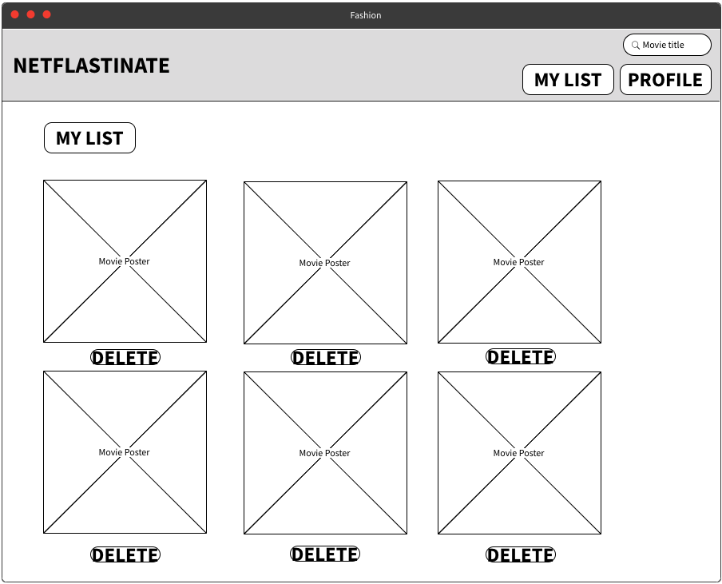
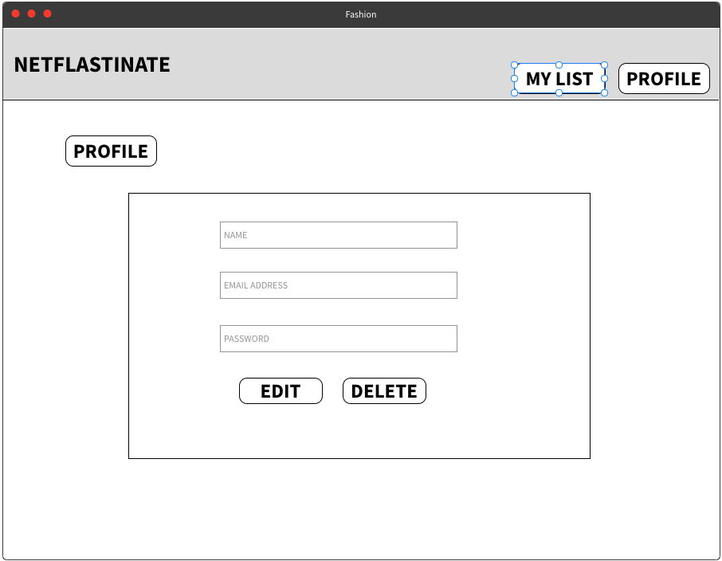
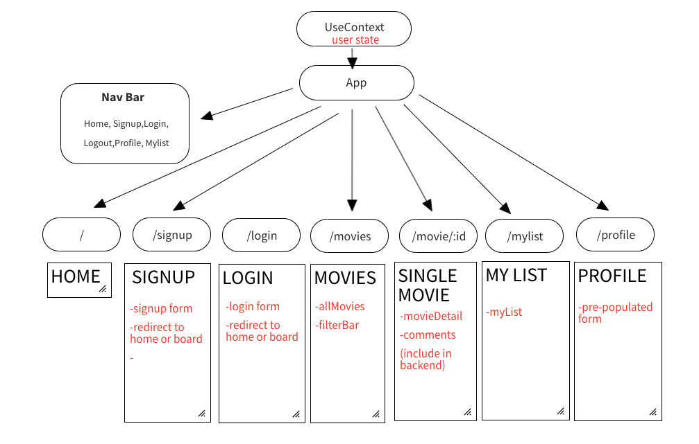
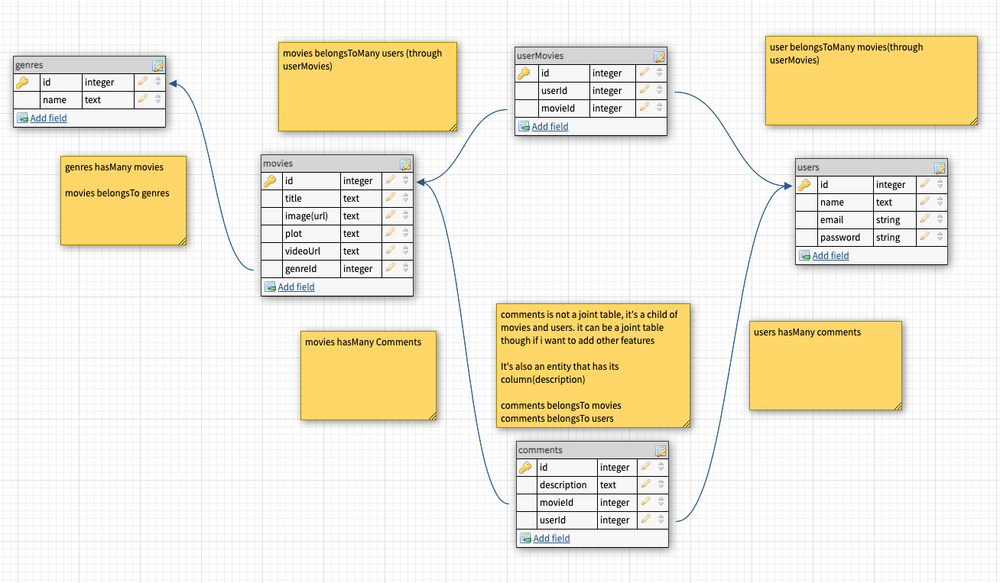

# Netflastinate-frontend
## About Netflastinate
**Netflastinate is a movie trailer app where you can watch movie trailers, and save them to your watchlist**

***"Netflastinate" is a slang term used when you use Netflix to procrastinate.***

## Wireframes
<details>
<summary>Click to see wireframes</summary>








</details>

## User Stories

- When I go onto the first page, I see homepage,login and signup buttons.
- I can sign-up with name, email, password.
- When I login, all movie trailers are shown sorted by genre, I can filter this list using a search bar, there are my list, sign-out and profile buttons. 
- When I click a trailer, it shows a popup containing a simplified movie detail, and a play button.
- When I click a play button, it redirects me to a single movie page containing movie detail, trailer and a save button.
- I can see a comment section where I can leave comments and see other's comments. I can edit and delete my comments.
- If I click a save button, it saves trailers to my watch list.
- I can go to my list and see my saved trailer with delete buttons.
- In my profile page, I can see pre-populated profile info, and I can edit/delete my profile.

## Frontend components tree
<details>
<summary>Click to see</summary>



</details>

## ERD
<details>
<summary>Click to see</summary>



</details>

## HTTP Routes
<details>
<summary>Click to see</summary>

[Users]

| Method | Path                   | Purpose                                | Note                       |
|--------|------------------------|----------------------------------------|----------------------------|
| GET    | /users                 | Get user profile info                  | use auth headers for userId|
| GET    | /users/mylist          | Show saved contents in my list         | use auth headers for userId|
| POST   | /users                 | Sign-up                                |
| POST   | /users/login           | Log-in                                 |
| PUT    | /users/profile         | Edit user profile info                 |use auth headers for userId |
| DELETE | /users/profile         | Delete user account                    | use auth headers for userId|


[Movie] * /:id/ refers to the id of whatever that comes before /:id/ *
| Method | Path                   | Purpose                         | Note                                    |
|--------|------------------------|---------------------------------|-----------------------------------------|
| GET    | /movies                | Get movie list from api         | 
| GET    | /movies/:id             | Movie detail and comments       |Fetch movie detail, and include comments |   
| POST   | /movies/:id             | User can save movies            |
| DELETE | /movies/:id             | User can delete saved movies    |


[Comment]
| Method | Path                           | Purpose                         |
|--------|--------------------------------|---------------------------------|
| POST   | /movies/:id/comment/:commentId | Leave comments                  |
| PUT    | /movies/:id/comment/:commentId | Edit comments                   |
| DELETE | /movie/:id/commens/:commentId  | Delete comments                 |


</details>

## MVP checklist 
- Can I sign up, sign in and sign out?
- Can I see all movie list and play trailers?
- Can I see my list? (save movies in my list)

### Stretch goals
- Can I delete saved movies from my list?
- Can I leave/edit/delete my comments?
- Can I see my profile and edit/delete it?
- Can I see a loading screen?
- If I click a movie from my list, it takes me to movie detail page.
</details>

## Work flow
<details>
<summary>Click to see </summary>

1. Work on backend and frontend synchronously.
2. Setup (frontend, backend initial setup)
3. Make database, add constraints/validations, associations.
4. Deploy the app at its most basic.
5. Set front/backend servers and run them.
6. Controllers and Routers in backend.
7. All functionalities in frontend using(context, components, props)
8. CRUD 
     <p>[Create]</p>

    - Signup
    - Signin
    - Save movies  
    - Leave comments 

    <p>[Read]</p>

    - All movie list
    - Movie info popup
    - Movie detail and a trailer player
    - User profile info
    - My list(saved movie list)
    - All comment list

    <p>[Update]</p>

    - User profile info editing
    - Comment editing

    <p>[Delete]</p>
    
    - Delete user account
    - Delete saved movies from my list
    - Delete comments

9. Signout functionality.
10. Styling up browser with CSS.
</details>

## Credit


## Set Up Cheat sheet 
<details><summary>Click to see </summary>


<details><summary>Frontend</summary>
<p>

- Dependencies

1. react-router-dom
1. axios
1. react-dotenv (if you decide to use this)

- Frontend setup
1. yarn create react-app your_app_name
1. yarn install (if you clone down and use a repo that already has a react app)
1. yarn add Dependencies to React app folder!!(written above) 
1. adjust index.js 
`import {BrowserRouter} from 'react-router-dom'`
```
ReactDOM.render(
  <React.StrictMode>
    <BrowserRouter>
      <App />
    </BrowserRouter>
</React.StrictMode>,
  document.getElementById('root')
);
```
1. Create .env in the root and add `REACT_APP_BACKEND_URL=Your-API-URL`(if you choose to use the builtin env instead of react-dotenv)
1. .gitignore(node_modules, .env(if you use dotenv))
1. Wipe up unneeded code in App.js
1. `Console.log(process.env.REACT_APP_BACKEND_URL)` in App.js to see if the server is running 

</p>

</details>


<details><summary>Backend</summary>
<p>

- Dependencies

1. cors
1. dotenv
1. express (http verb and route)
1. morgan
1. pg (is needed to create db(sequelize db:create))
1. rowdy-logger (a tool that gives a quick summary of all routes)
1. axios (if you use a third party api)
1. sequelize 
1. sequelize-cli
1. dotenv and jsonwebtoken (for encrypting id)
1. bcrypt(for db hashing)

- backend setup

1. npm i -y
1. npm init 
1. npm install dependencies(written above) or just npm install(if you clone down a repo that has all npm packages)
1. .gitignore (add node_modules, config/config.json)
1. sequelize init (To create config, migrations, models, and seeders) 
1. adjust config
1. adjust script in package.json(npm run dev will not run if you don't add this)
```
"start": "node server.js",
"dev": "nodemon server.js"
```
1. create database (sequelize db:create)
1. create sequelize models
   - sequelize model:generate --name tableName --attributes columnName:dataType,columnName:dataType,columnName:dataType
1. Check models, add unique constraints to migration (other validations should be added to models)
1. sequelize db:migrate
1. make associations to models
1. make server.js
1. make controllers, routers folders

1. Command Line
   - npm run dev (run backend server)
   - or node server.js

   

1. Reference
   - https://github.com/SEI-SEA-1-25/intro-to-sequelize
   - https://github.com/SEI-ATL-3-8/intro-to-express


```
const express = require('express')
const app = express()

app.use(require('morgan')('tiny'))
const routesReport = require('rowdy-logger').begin(app)

app.use(express.json())
app.use(require('cors')())

const PORT = process.env.PORT || 3001
app.listen(PORT, () => {
  console.log(`server listening on ${PORT}`);
  routesReport.print()
})
```

1. test if that server runs successfully(nodemon server.js or npm run dev)
1. How to add/create seed files 

```
sequelize-cli seed:generate --name <table name you want to seed to>
sequelize-cli db:seed:all
sequelize-cli db:seed:undo:all

```

</p>

</details>


<details><summary>UseContext</summary>
<p>

1. Create your store (the context)

```
import {useState, createContext } from 'react'

const UserContext = createContext()

const UserProvider = ({children}) => {
    const [user,setUser] = useState({})
    const [color,setColor] = useState('red')

    const state = {
        userState: [user,setUser],
        fetchUser: fetchUser,
        colorState: [color,setColor]
    }

    return (
        <UserContext.Provider value={state}>
            {children}
        </UserContext.Provider>
    )
}

export { UserContext, UserProvider}
```

1. Wrap your app in the Context(store) Provider

```
import React from 'react';
import ReactDOM from 'react-dom';
import { BrowserRouter } from 'react-router-dom'
import './index.css';
import App from './App';
import reportWebVitals from './reportWebVitals';
import {UserProvider} from './context/UserContext'
ReactDOM.render(
  <BrowserRouter>
    <React.StrictMode>
      <UserProvider>
        <App />
      </UserProvider>
    </React.StrictMode>
  </BrowserRouter>,
  document.getElementById('root')
);

// If you want to start measuring performance in your app, pass a function
// to log results (for example: reportWebVitals(console.log))
// or send to an analytics endpoint. Learn more: https://bit.ly/CRA-vitals
reportWebVitals();

```

1. Any child component should follow these steps to access the store

   

</p>
</details>
</details>